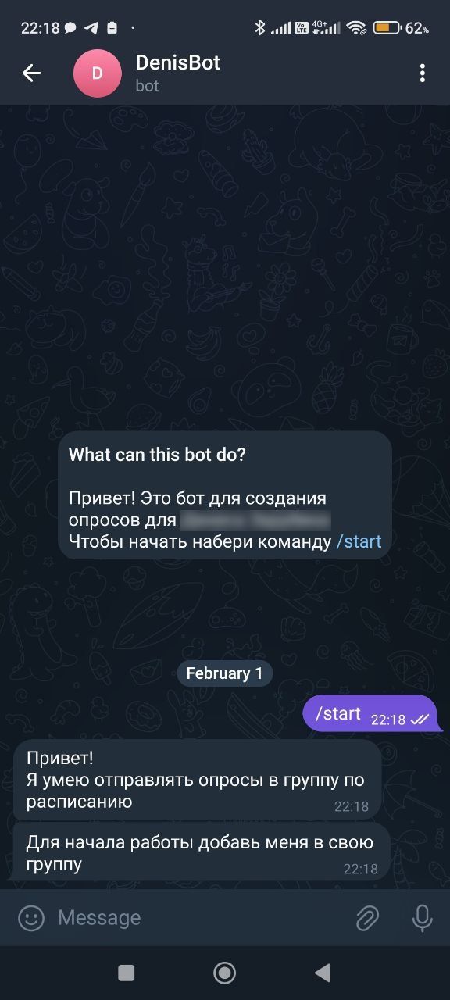

# simple_polling_tgbot

Бот для отправки опроса в телеграм чат по будням в заданное время.

### Установка
Устанавливаем используемые библиотеки
```bash
pip install -r requirements.txt
```

### Запуск

Для запуска бота в терминале необходимо ввести команду:
```bash
python3 denis_bot.py
```

### Использование бота

Для использованмя бота ему нужно сперва написать:  


Далее необходимо добавить его в группу и следовать инструкциям, как показано ниже  


### TODO
- [ ] поддержка множества чатов
- [ ] создание опроса только администратором чата
- [ ] сохранение настроек при перезапуске бота